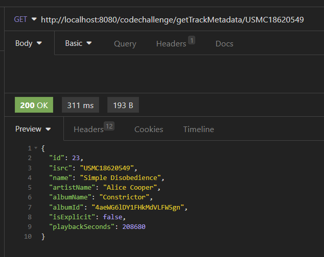
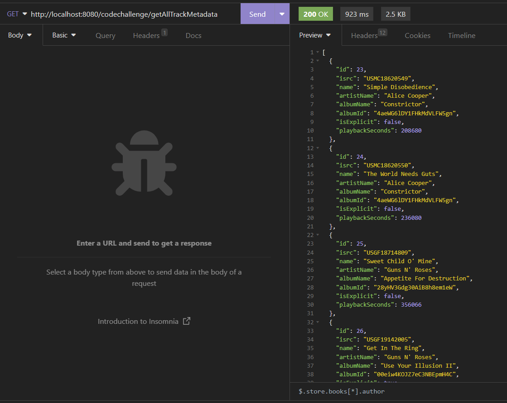
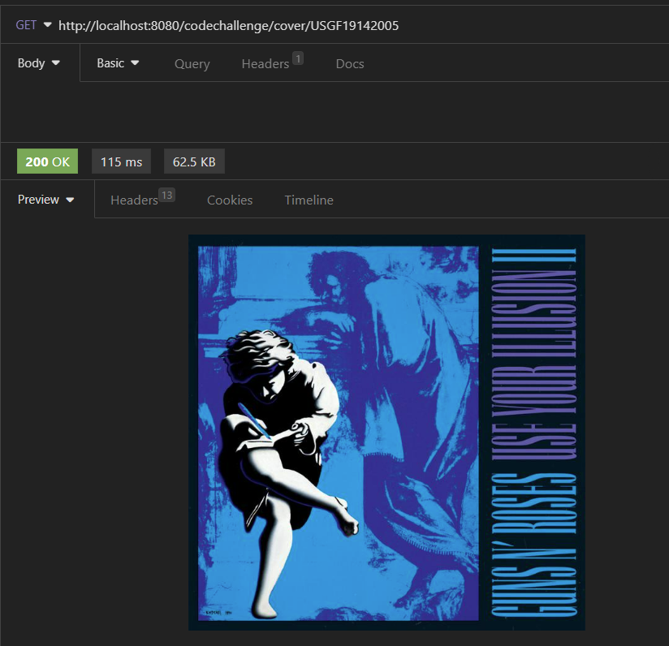

# UMG BACKEND APP

REST-API for requesting metadata of a music track from an external service storing it in a
database.


## API Reference

#### Create Track Metadata
```http
  POST /codechallenge/createTrack?isrc=${isrc}
```
| Parameter | Type     | Description                             |
| :-------- | :------- |:----------------------------------------|
| `isrc`      | `string` | ISRC of the track to fetch            |

#### Get all Tracks Metadata
```http
  GET /codechallenge/getAllTrackMetadata
```

#### Get Track Metadata
```http
  GET /codechallenge/getTrackMetadata/${isrc}
```

| Parameter | Type     | Description                             |
| :-------- | :------- |:----------------------------------------|
| `isrc`      | `string` | ISRC of the track to fetch            |

#### Get Track Cover
```http
  GET /codechallenge/cover/${isrc}
```

| Parameter | Type     | Description                             |
| :-------- | :------- |:----------------------------------------|
| `isrc`      | `string` | ISRC of the track to fetch            |


## Environment Variables

To run this project, you will need to have a [Spotify account](https://developer.spotify.com/documentation/web-api) and to add the following
environment
variables to your .env file

`SPOTIFY_CLIENTID`

`SPOTIFY_CLIENTSECRET`

## Run Locally

Clone the project

```bash
  git clone https://github.com/flaviobarbosa/umg-backend.git
```

Go to the project directory

```bash
  cd umg-backend
```

Start the server

```bash
  SPOTIFY_CLIENTID=<your_spotify_clientId> SPOTIFY_CLIENTESECRET=<your_spotify_secret> docker-compose up
```


## Screenshots

#### Create


#### Get Track Metadata


#### Get all Tracks Metadata


#### Get cover
